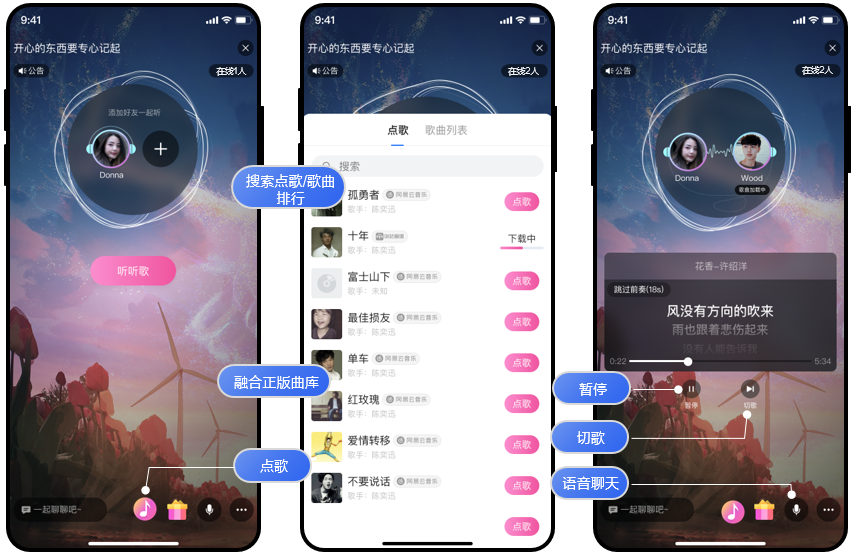

# 简介

网易云信语聊房场景方案为您提供 iOS 和 Android 端的 Demo App 与示例项目源码。您可以安装对应 App，快速体验网易云信语聊房和一起听场景。

# 功能列表
语聊房 Demo 提供标准语聊房和一起听两个场景，功能列表分别如下：
标准语聊房的主要功能如下表所示。

|  主要功能   | 功能描述  |
|  ----  | ----  |
| 音频通话  | RTC 方案：超低延时下，观众可以实时接收房主或连麦者的音频流，保证语聊房互动顺畅。CDN 方案：观众可以通过   CDN 拉流接收主播或连麦者的音频流。主播和连麦者之间可做到实时音视频通话。 |
| 连麦互动  | 房主邀请或观众申请上麦。观众上麦后成为连麦主播。房间内所有用户都可以实时观看房主和连麦主播互动。 |
|  麦位管理 | 麦位即语聊房的座位。房主或管理员也可以对麦位进行管理，包括对麦位上的连麦主播进行下麦、禁麦、解禁等操作。  上麦：邀请观众上麦。观众上麦后成为连麦主播，可以和房主实时互动。  下麦：将连麦主播恢复为普通观众。  禁麦：不允许连麦主播发言，该连麦主播被静音。  解禁：恢复连麦主播的发言权限。  锁麦：锁住麦位，不允许任何人上麦。  抱麦：主动把用户抱到指定麦位上。  踢人：踢掉对应麦位上的用户。  跳麦：允许用户跳到另一个空闲的麦位上。 |
| 消息互动  | 语聊房内的所有角色都可以发送和接收文字消息，实时文字互动。 |
| 房间人员管理  | 房主或管理员可以文字禁言某位观众，此人不能发送任何文字消息，也可以拉黑或踢人。 |
|  进出房间通知 | 聊天室内的所有角色都可以实时了解当前语聊房的人员增减信息，即谁进入了聊天室，或谁离开了聊天室。 |
| 房间信息查询  | 聊天室内的所有角色都可以实时查看聊天室在线人数和互动成员列表。 |
| 质量数据回调  | 所有用户都可以查看当前的通话的质量数据，实时了解通话状况。 |
| 背景音乐  | 数十万首版权歌曲实时更新。主播通过搜索或歌曲列表播放背景音乐。 |
| 音效  |  主播播放声音效果，所有观众都能听到，便于烘托主题气氛。|
|  耳返 |  采集声音监听，让主播听见自己发出的声音。帮助主播在演唱的同时获得一个真实、及时的反馈，用来鉴定音准。 |
| 悬浮小窗  | 当您的手机需要操作其他界面时，您可以单击右上角最小化按钮，将语聊房窗口设置为悬浮小窗模式，使任务切换更便捷。 |
| 音频波谱  | 主播、连麦者说话时，相应的麦位上会展示音频波谱，以便观众识别当前说话者。 |

一起听的主要功能如下表所示。

|  主要功能 | 功能描述 |
|  ----  | ----  |
|  一起听歌 | 房主和连麦者均可进行点歌、切歌、暂停/恢复播放、拖动进度条。  |
|  融合曲库  | 数十万首版权歌曲实时更新。 覆盖 70、80 劲歌金曲、 Y 时代流行音乐、Z 时代热门原创，完美匹配不同用户圈层。  |
|  实时语音通话  | 房主和连麦者可以进行语音互动。  |
|  即时消息  | 房主和连麦者可以进行文字聊天。  |

# 效果演示

> 内容拷贝场景方案文档的 “体验Demo ”章节。包括Demo的二维码和界面效果图展示。
> 如果前面功能列表中已经有界面截图，这里可以不再添加界面截图。
> 您可以扫描下方二维码，下载并体验在线 K 歌 Demo App。

| iOS                                                          | Android                                                      |
| ------------------------------------------------------------ | ------------------------------------------------------------ |
|   |   | 

标准语聊房 的界面效果如下图所示：

一起听 的界面效果如下图所示：

# 联系我们

- 如果想要了解该场景的更多信息，请参见[语聊房场景方案文档](https://doc.yunxin.163.com/group-voice-room/docs/home-page?platform=android)
- 完整的API文档请参见[API参考](https://doc.yunxin.163.com/group-voice-room/api-refer)
- 如果您遇到的问题，可以先查阅[知识库](https://faq.yunxin.163.com/kb/main/#/)
- 如果需要售后技术支持，请[提交工单](https://app.yunxin.163.com/index#/issue/submit)  

# 更多场景方案

网易云信针对1V1娱乐社交、语聊房、PK连麦、在线教育等业务场景，推出了一体式、可扩展、功能业务融合的全链路解决方案，帮助客户快速接入、业务及时上线，提高营收增长。

- [1对1 娱乐社交](https://github.com/netease-kit/1V1)
- [PK连麦](https://github.com/netease-kit/OnlinePK)
- [在线教育](https://github.com/netease-kit/WisdomEducation)
- [多人视频通话](https://github.com/netease-kit/NEGroupCall)